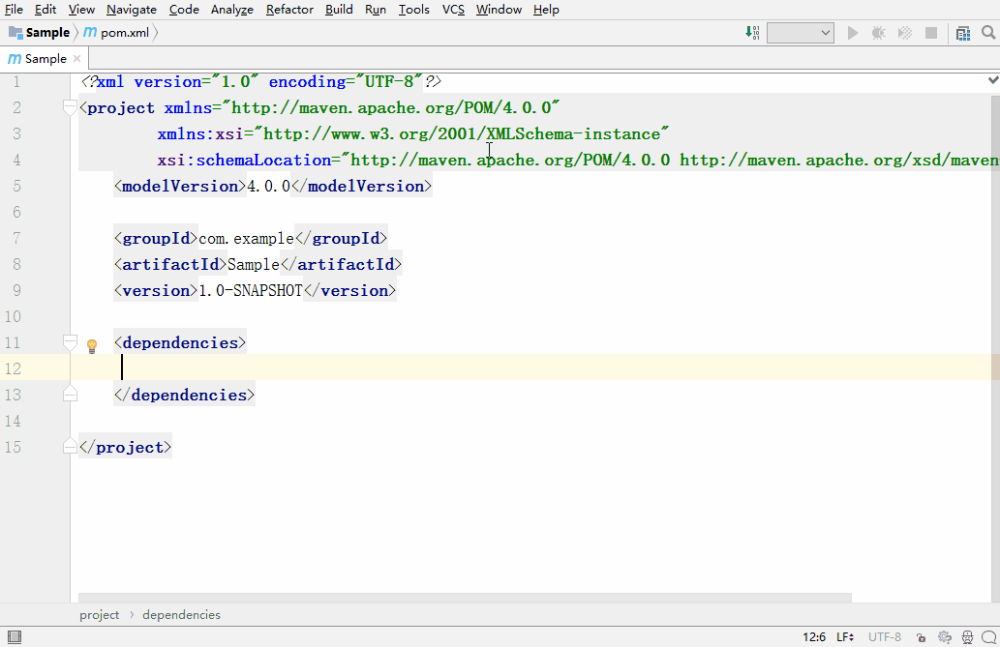

# MavenRepoSearcher

## 用途
MavenRepoSearcher是一个方便在IDEA中直接搜索Maven项目的插件，数据来源http://mvnrepository.com/

	

## 安装
没有上传到IDEA的插件市场，直接下载MavenRepoSearcher.jar，然后Settings --> Plugins --> Install plugin from disk

## 使用
在菜单栏的Window --> RepoSearch，输入要检索的Maven项目名，例如common io，然后会列出检索结果，选择相应的项目和版本，得到具体的Maven Dependency，最后复制粘贴

## 开源协议
    The MIT License (MIT)

    Copyright (c) 2018 Wang-Jiang

    Permission is hereby granted, free of charge, to any person obtaining a copy
    of this software and associated documentation files (the "Software"), to deal
    in the Software without restriction, including without limitation the rights
    to use, copy, modify, merge, publish, distribute, sublicense, and/or sell
    copies of the Software, and to permit persons to whom the Software is
    furnished to do so, subject to the following conditions:

    The above copyright notice and this permission notice shall be included in all
    copies or substantial portions of the Software.

    THE SOFTWARE IS PROVIDED "AS IS", WITHOUT WARRANTY OF ANY KIND, EXPRESS OR
    IMPLIED, INCLUDING BUT NOT LIMITED TO THE WARRANTIES OF MERCHANTABILITY,
    FITNESS FOR A PARTICULAR PURPOSE AND NONINFRINGEMENT. IN NO EVENT SHALL THE
    AUTHORS OR COPYRIGHT HOLDERS BE LIABLE FOR ANY CLAIM, DAMAGES OR OTHER
    LIABILITY, WHETHER IN AN ACTION OF CONTRACT, TORT OR OTHERWISE, ARISING FROM,
    OUT OF OR IN CONNECTION WITH THE SOFTWARE OR THE USE OR OTHER DEALINGS IN THE
    SOFTWARE.